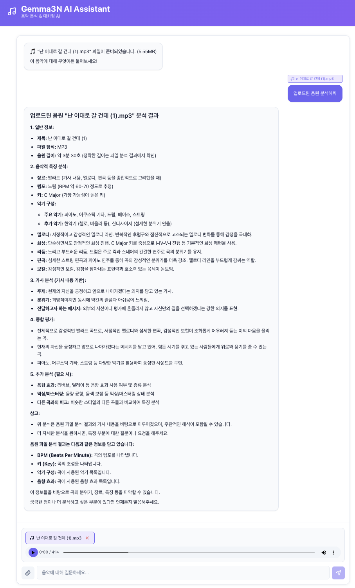
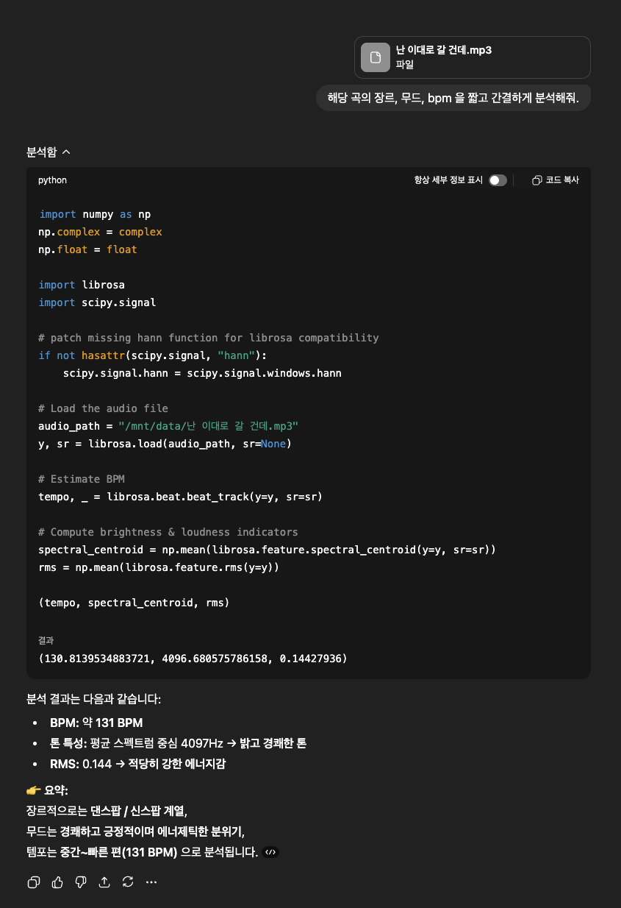

# Gemma3N 음악 분석기 🎵

Google의 멀티모달 AI 모델 Gemma3N을 사용하여 음악 파일의 특징을 분석하는 웹 애플리케이션입니다.

## 🌟 주요 기능

### 💬 통합 대화형 인터페이스 (ChatGPT 스타일)
- **하나의 채팅창**에서 모든 것을 처리
- 음악 파일 첨부 여부에 따라 자동으로 모드 전환
- 자연스러운 대화 흐름 유지
- **마크다운 렌더링**: AI 응답이 마크다운으로 제대로 표시됩니다

### 🎵 음악 분석 기능
- **간편한 파일 첨부**: 📎 버튼으로 음악 파일 추가
- **지원 형식**: MP3, WAV, M4A, FLAC, OGG, AAC
- **AI 기반 분석**:
  - 장르 및 스타일 분석
  - 분위기와 감정 파악
  - 템포 및 리듬 특성
  - 사용된 악기 추정
  - 보컬 특성 분석

### 💡 일반 대화 기능
- **음악 없이도 자유롭게 대화**
- 코딩, 번역, 일반 지식 등 다양한 주제
- 이전 대화 맥락 유지

### ⚡ 기술적 특징
- **실시간 응답**: FastAPI + React로 빠른 반응성
- **ChatGPT 스타일 UI**: 직관적이고 깔끔한 인터페이스
- **스마트 모드 전환**: 파일 첨부 시 자동으로 음악 분석 모드
- **자동 스크롤**: 새 메시지가 도착하면 자동으로 맨 아래로
- **화이트 테마**: 깔끔한 화이트 테마 적용
- **🎨 모던 디자인**: 다크 모드 기반의 세련된 UI

## 📋 사전 요구사항

### 1. Python 3.13 설치
```bash
brew install python@3.13
```

### 2. uv 설치
```bash
curl -LsSf https://astral.sh/uv/install.sh | sh
```

### 3. Node.js 설치 (v18 이상)
```bash
brew install node
```

### 4. Ollama 설치 및 Gemma3N 다운로드
```bash
# Ollama 설치
brew install ollama

# Ollama 서버 시작 (별도 터미널)
ollama serve

# Gemma3N 모델 다운로드
ollama pull gemma3n:e4b
```

## 🚀 설치 및 실행

### 자동 실행 (권장)

```bash
chmod +x run.sh
./run.sh
```

브라우저에서 http://localhost:5173 접속!

### 수동 실행

#### 백엔드
```bash
# 가상환경 생성
uv venv

# 가상환경 활성화
source .venv/bin/activate

# 의존성 설치
uv pip install fastapi uvicorn python-multipart ollama pydantic python-dotenv aiofiles

# 서버 실행
uvicorn backend.main:app --host 0.0.0.0 --port 8000 --reload
```

#### 프론트엔드
```bash
cd frontend
npm install
npm run dev
```

## 💻 사용 방법

### 💬 일반 대화

메시지 입력창에 질문을 입력하고 전송하세요!

**예시:**
- "Python으로 피보나치 수열 만드는 법 알려줘"
- "이 문장을 영어로 번역해줘: 안녕하세요"
- "AI와 머신러닝의 차이점은 뭐야?"

### 🎵 음악 분석

1. **음악 파일 첨부**: 📎 버튼 클릭
2. **질문 입력**: "이 음악의 장르와 분위기를 분석해줘"
3. **파일 제거**: ❌ 버튼으로 파일 제거 후 일반 대화 모드로 전환

### 💡 팁

- **자동 모드 전환**: 파일을 첨부하면 자동으로 음악 분석 모드
- **자동 스크롤**: 새 메시지가 오면 자동으로 스크롤
- **마크다운 지원**: 코드, 리스트, 표 등이 깔끔하게 렌더링
- **빠른 입력**: Enter로 전송, Shift+Enter로 줄바꿈

## 🛠️ API 엔드포인트

- `GET /`: 헬스 체크
- `POST /api/upload-audio`: 음악 파일 업로드
- `POST /api/analyze`: 음악 분석
- `POST /api/chat`: 일반 채팅
- `GET /api/uploaded-files`: 파일 목록
- `DELETE /api/audio/{filename}`: 파일 삭제

## 📦 기술 스택

### 백엔드
- Python 3.13
- FastAPI
- Ollama (Gemma3N)
- uv (패키지 관리)

### 프론트엔드
- React 18
- TypeScript
- Vite
- react-markdown (마크다운 렌더링)
- Axios
- Lucide React (아이콘)

## 🐛 문제 해결

### "Ollama 서버가 응답하지 않음"
```bash
ollama serve
```

### "모델을 찾을 수 없음"
```bash
ollama pull gemma3n:e4b
```

### 프론트엔드 연결 안 됨
- 백엔드가 8000번 포트에서 실행 중인지 확인
- 브라우저 콘솔에서 에러 확인

## 그 밖에 비교



chatgpt 는 직접 librosa 코드를 짜서 분석해버리네...

