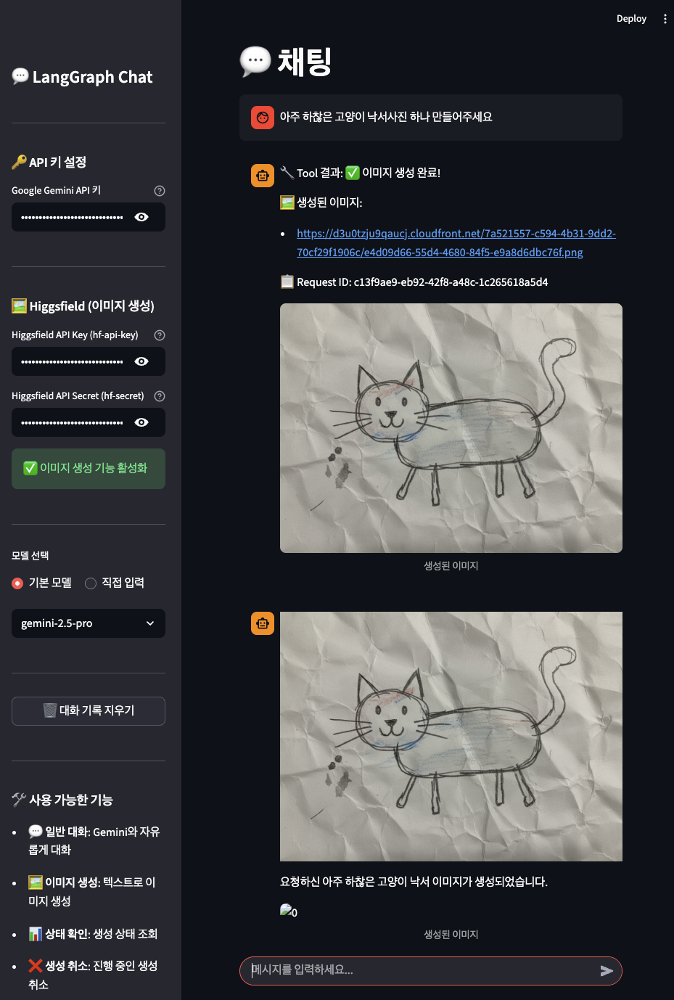

# 💬 LangGraph Chat

LangGraph와 Streamlit을 활용한 AI 채팅 인터페이스입니다. Google Gemini LLM을 기반으로 대화하며, Higgsfield API를 통한 이미지 생성 기능을 제공합니다.



## ✨ 주요 기능

- **💬 일반 대화**: Google Gemini와 자유롭게 대화
- **🖼️ 이미지 생성**: Higgsfield API (Nano Banana 모델)를 통한 텍스트 기반 이미지 생성
- **📊 상태 확인**: 이미지 생성 요청 상태 조회
- **❌ 생성 취소**: 진행 중인 이미지 생성 요청 취소
- **💾 대화 히스토리**: LangGraph 체크포인터를 통한 대화 기록 유지

## 🛠️ 기술 스택

- **Frontend**: Streamlit
- **LLM Framework**: LangChain, LangGraph
- **LLM**: Google Gemini (gemini-2.5-flash, gemini-2.5-pro 등)
- **Image Generation**: Higgsfield API (Nano Banana)
- **Python**: 3.13+

## 📁 프로젝트 구조

```
langgraph-streamlit/
├── main.py                 # Streamlit UI 앱
├── graph.py                # LangGraph 채팅 그래프 구성
├── tools/                  # LangChain Tools
│   ├── __init__.py
│   └── higgsfield.py       # Higgsfield 이미지 생성 Tool
├── notebooks/              # Jupyter 노트북 (테스트/실험용)
├── statics/                # 정적 파일 (이미지 등)
├── pyproject.toml          # 프로젝트 설정
└── README.md
```

## 🚀 시작하기

### 1. 의존성 설치

```bash
# uv 사용 (권장)
uv sync

# 또는 pip 사용
pip install -e .
```

### 2. 환경 변수 설정

`.secrets` 파일을 생성하고 API 키를 설정하세요:

```
GOOGLE_API_KEY=your_gemini_api_key
HIGGSFIELD_API_KEY=your_higgsfield_api_key
HIGGSFIELD_API_SECRET=your_higgsfield_api_secret
```

또는 앱 실행 후 사이드바에서 직접 입력할 수 있습니다.

### 3. 앱 실행

```bash
uv run streamlit run main.py
```

브라우저에서 `http://localhost:8501`로 접속하세요.

## 🔑 API 키 발급

### Google Gemini API
1. [Google AI Studio](https://makersuite.google.com/app/apikey)에서 API 키 발급
2. 사이드바의 "Google Gemini API 키" 필드에 입력

### Higgsfield API (이미지 생성)
1. [Higgsfield Platform](https://platform.higgsfield.ai)에서 계정 생성
2. API Key와 Secret 발급
3. 사이드바의 "Higgsfield API Key"와 "Higgsfield API Secret" 필드에 입력

## 💡 사용 예시

### 이미지 생성
```
"아주 하찮은 고양이 낙서사진 하나 만들어주세요"
"16:9 비율로 우주에서 본 지구 이미지 생성해줘"
"png 포맷으로 미래 도시 이미지 2개 만들어줘"
```

### 이미지 생성 옵션
| 파라미터 | 설명 | 기본값 | 옵션 |
|---------|------|-------|------|
| `prompt` | 이미지 프롬프트 | (필수) | 최소 2자 |
| `aspect_ratio` | 이미지 비율 | 4:3 | auto, 1:1, 4:3, 3:4, 3:2, 2:3, 16:9, 9:16 |
| `num_images` | 생성 이미지 수 | 1 | 1-4 |
| `output_format` | 출력 포맷 | png | jpeg, png |

## 🏗️ 아키텍처

```
┌─────────────────┐
│   Streamlit UI  │
└────────┬────────┘
         │
         ▼
┌─────────────────┐     ┌──────────────┐
│  LangGraph      │────▶│  Gemini LLM  │
│  Chat Graph     │     └──────────────┘
└────────┬────────┘
         │ (Tool Call)
         ▼
┌─────────────────┐     ┌──────────────┐
│   ToolNode      │────▶│  Higgsfield  │
│                 │     │     API      │
└─────────────────┘     └──────────────┘
```

### LangGraph 그래프 흐름
1. **chatbot**: 사용자 메시지를 받아 Gemini LLM으로 응답 생성
2. **should_continue**: Tool 호출이 필요한지 판단
3. **tools**: Tool 실행 (이미지 생성, 상태 확인, 취소)
4. Tool 실행 후 다시 chatbot으로 돌아가 결과 설명

## 📝 라이선스

MIT License
